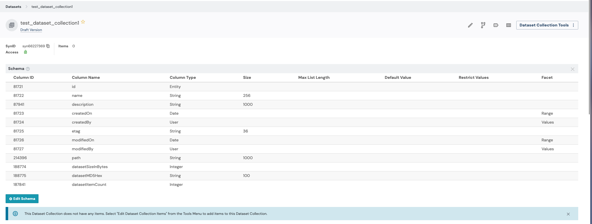
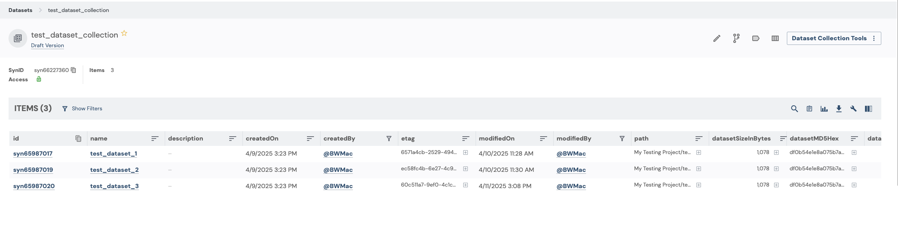

## Dataset Collections

Dataset Collections are a way to organize, annotate, and publish sets of datasets for others to use. Dataset Collections behave similarly to Tables and EntityViews, but provide some default behavior that makes it easy to put a group of datasets together.

This tutorial will walk through basics of working with Dataset Collections using synapser.

### Tutorial Purpose

In this tutorial, you will:

- Create a Dataset Collection
- Add datasets to the collection
- Add a custom column to the collection
- Update the collection with new annotations
- Query the collection
- Save a snapshot of the collection

### Prerequisites

* This tutorial assumes that you have a project in Synapse and have already created datasets that you would like to add to a Dataset Collection.
* If you need help creating datasets, you can refer to the [Dataset](dataset.html) tutorial.

## 1. Get the ID of your Synapse project

Let's get started by authenticating with Synapse and retrieving the ID of your project.

```{r eval=FALSE}
library(synapser)

# First, let's get the project that we want to create the DatasetCollection in
synLogin()

project = Project(
  name = "My uniquely named project about Alzheimer's Disease"
) |> synGet()  # Replace with your project name
project_id = project$id
print(sprintf("My project ID is %s", project_id))
```

## 2. Create your Dataset Collection

Next, we will create the Dataset Collection using the project ID to tell Synapse where we want the Dataset Collection to be created. After this step, we will have a Dataset Collection object with all of the necessary information to start building the collection.

```{r eval=FALSE}
DATASET_IDS = c(
  "syn65987017",
  "syn65987019",
  "syn65987020"
)  # Replace with your dataset IDs
test_dataset_collection = DatasetCollection(
  parent_id = project_id, name = "test_dataset_collection"
) |> synStore()
print(sprintf("My DatasetCollection's ID is %s", test_dataset_collection$id))
```

Because we haven't added any datasets to the collection yet, it will be empty, but if you view the Dataset Collection's schema in the UI, you will notice that Dataset Collections come with default columns.



## 3. Add Datasets to the Dataset Collection

Now, let's add some datasets to the collection. We will loop through our dataset ids and add each dataset to the collection using the `synAddItem()` function.

```{r eval=FALSE}
for (dataset_id in DATASET_IDS) {
  test_dataset_collection |> synAddItem(Dataset(id = dataset_id) |> synGet())
}
```

Whenever we make changes to the Dataset Collection, we need to call the `synStore()` function to save the changes to Synapse.

```{r eval=FALSE}
test_dataset_collection |> synStore()
```

And now we are able to see our Dataset Collection with all of the datasets that we added to it.



## 4. Retrieve the Dataset Collection

Now that our Dataset Collection has been created and we have added some Datasets to it, we can retrieve the Dataset Collection from Synapse the next time we need to use it.

```{r eval=FALSE}
my_retrieved_dataset_collection = DatasetCollection(id = test_dataset_collection$id) |> synGet()
print(sprintf("My DatasetCollection's ID is still %s", my_retrieved_dataset_collection$id))
print(sprintf("My DatasetCollection has %d items", length(my_retrieved_dataset_collection$items)))
```

## 5. Add a custom column to the Dataset Collection

In addition to the default columns, you may want to annotate items in your DatasetCollection using custom columns.

```{r eval=FALSE}
my_retrieved_dataset_collection |> synAddColumn(
  column = Column(
    name = "my_annotation",
    column_type = "STRING"
  )
)
my_retrieved_dataset_collection |> synStore()
```

Our custom column isn't all that useful empty, so let's update the Dataset Collection with some values.

```{r eval=FALSE}
modified_data = data.frame(
  id = DATASET_IDS,
  my_annotation = rep("good dataset", length(DATASET_IDS))
)
my_retrieved_dataset_collection |> synUpdateRows(
  values = modified_data, primary_keys = list("id"), dry_run = FALSE
)
```

## 6. Query the Dataset Collection

If you want to query your DatasetCollection for items that match certain criteria, you can do so using the `synQuery()` function.

```{r eval=FALSE}
rows = synQuery(
  query = sprintf(
    "SELECT id, my_annotation FROM %s WHERE my_annotation = 'good dataset'",
    my_retrieved_dataset_collection$id
  )
)
print(rows)
```

## 7. Save a snapshot of the Dataset Collection

Finally, let's save a snapshot of the Dataset Collection. This creates a read-only version of the Dataset Collection that captures the current state of the Dataset Collection and can be referenced later.

```{r eval=FALSE}
my_retrieved_dataset_collection |> synSnapshot(comment = "test snapshot")
```

## References

- [`DatasetCollection`](../reference/DatasetCollection.html)
- `Dataset`
- [`Project`](../reference/Project.html)
- [`Column`](../reference/Column.html)
- [`synLogin`](../reference/synLogin.html)
