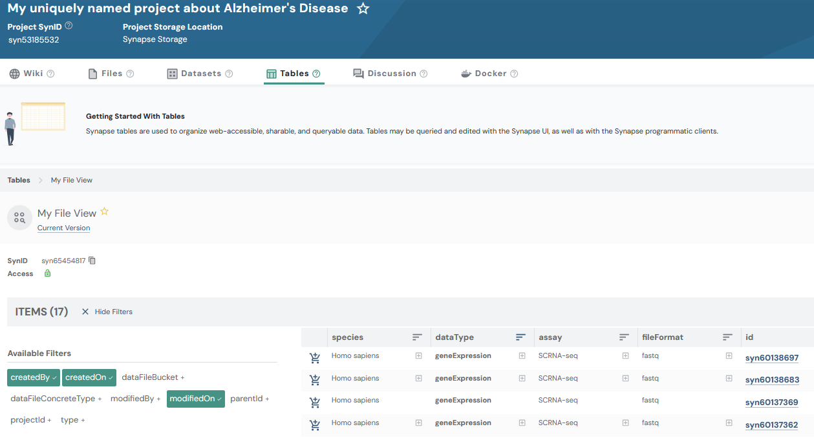

## EntityViews

EntityViews in Synapse allow you to create a queryable view that provides a unified selection
of entities stored in different locations within your Synapse project. This can be
particularly useful for managing and querying metadata across multiple files, folders,
or projects that you manage.

Views display rows and columns of information, and they can be shared and queried with
SQL. Views are queries of other data already in Synapse. They allow you to see groups
of entities including files, tables, folders, or datasets and any associated
annotations about those items.

Annotations are an essential component to building a view. Annotations are labels that
you apply to your data, stored as key-value pairs in Synapse. They help users search
for and find data, and they are a powerful tool used to systematically group and
describe things in Synapse.

This tutorial will follow a [Flattened Data Layout](https://python-docs.synapse.org/explanations/structuring_your_project/#flattened-data-layout-example). With a project that has this example layout:
```
.

└── single_cell_RNAseq_batch_1
    ├── SRR12345678_R1.fastq.gz
    └── SRR12345678_R2.fastq.gz
```

### Tutorial purpose

In this tutorial you will:

1. Create an EntityView with a number of columns
2. Query the EntityView
3. Update rows in the EntityView
4. Update the scope of your EntityView
5. Update the types of entities in your EntityView

### Prerequisites

* This tutorial assumes that you have a project in Synapse with one or more
files/folders. It does not need to match the given structure in this tutorial, but, if
you do not have this already set up you may reference the [Folder](folder.html) and [File](file.html) tutorials.

## 1. Find the Synapse ID of your project

First let's set up some constants we'll use in this script, and find the ID of our project

```{r collapse=TRUE, eval=FALSE}
library(synapser)
synLogin()

# First let's get the project we want to create the EntityView in
my_project = Project(name = "My uniquely named project about Alzheimer's Disease") |> synGet()
project_id = my_project$id
```

## 2. Create an EntityView with Columns

Now, we will create 4 columns to add to our EntityView. Recall that any data added to
these columns will be stored as an annotation on the underlying File.

```{r collapse=TRUE, eval=FALSE}
# Next let's add some columns to the EntityView, the data in these columns will end up
# being stored as annotations on the files
columns = list(
  Column(name = "species", column_type = "STRING"),
  Column(name = "dataType", column_type = "STRING"),
  Column(name = "assay", column_type = "STRING"),
  Column(name = "fileFormat", column_type = "STRING")
)
```

Next we're going to store what we have to Synapse and print out the results. The
`view_type_mask` is a bit mask of the entity types to include in the view; `0x01L`
selects Files.

```{r collapse=TRUE, eval=FALSE}
# Then we will create an EntityView that is scoped to the project, and will contain a row
# for each file in the project
view = EntityView(
  name = "My Entity View",
  parent_id = project_id,
  scope_ids = list(project_id),
  view_type_mask = 0x01L, # File
  columns = columns
) |> synStore()

cat("My EntityView ID is:", view$id, "\n")

# When the columns are printed you'll notice that it contains a number of columns that
# are automatically added by Synapse in addition to the ones we added
names(view$columns)
```

## 3. Query the EntityView

```{r collapse=TRUE, eval=FALSE}
# Query the EntityView
results = synQuery(
  query = sprintf(
    "SELECT id, name, species, dataType, assay, fileFormat, path FROM %s WHERE path like '%%single_cell_RNAseq_batch_1%%'",
    view$id
  ),
  include_row_id_and_row_version = FALSE
)
results
```

<details class="example">
  <summary>The result of querying your File View should look like:</summary>
```
  id        name                       species         dataType...
1 syn1      SRR12345678_R1.fastq.gz    Homo sapiens    geneExpression
2 syn2      SRR12345678_R2.fastq.gz    Homo sapiens    geneExpression
```
</details>

## 4. Update rows in the EntityView

Now that we know the data is present in the EntityView, let's go ahead and update the
annotations on these Files. The following code sets all returned rows to a single
value. Since the results were returned as a data frame you have many
options to search through and set values on your data.

```{r collapse=TRUE, eval=FALSE}
# Finally let's update the annotations on the files in the project
results$species = rep("Homo sapiens", nrow(results))
results$dataType = rep("geneExpression", nrow(results))
results$assay = rep("SCRNA-seq", nrow(results))
results$fileFormat = rep("fastq", nrow(results))

view |> synUpdateRows(
  values = results,
  primary_keys = list("id"),
  wait_for_eventually_consistent_view = TRUE
)
```

A note on `wait_for_eventually_consistent_view`: EntityViews in Synapse are eventually
consistent, meaning that updates to data may take some time to be reflected in the
view. The `wait_for_eventually_consistent_view` flag allows the code to pause until
the changes are fully propagated to your EntityView. When this flag is set to `TRUE` a
query is automatically executed on the view to determine if the view contains the
updated changes. It will allow your next query on your view to reflect any changes that
you made. Conversely, if this is set to `FALSE`, there is no guarantee that your next
query will reflect your most recent changes.

## 5. Update the scope of your EntityView

As your project expands or contracts you will need to adjust the containers you'd like
to include in your view. In order to accomplish this you may modify the `scope_ids`
attribute on your view.

```{r collapse=TRUE, eval=FALSE}
# Over time you may have a need to add or remove scopes from the EntityView. Set
# scope_ids to the full list of Synapse IDs you want the view to include
view$scope_ids = list(project_id, "syn1234")
# view$scope_ids = list(project_id)
view |> synStore()
```

## 6. Update the types of Entities included in your EntityView

You may also want to change what types of Entities may be included in your view. To
accomplish this you'll be modifying the `view_type_mask` attribute on your view.

```{r collapse=TRUE, eval=FALSE}
# You may also need to add or remove the types of Entities that may show up in your view
# You will be able to specify multiple types using bitwOr(), or a single value
view$view_type_mask = bitwOr(0x01L, 0x08L) # File | Folder
# view$view_type_mask = 0x01L # File
view |> synStore()
```

The possible types are: File=`0x01`, Project=`0x02`, Table=`0x04`, Folder=`0x08`,
View=`0x10`, Docker=`0x20`, SubmissionView=`0x40`, Dataset=`0x80`,
DatasetCollection=`0x100`, MaterializedView=`0x200`.

## Results

Now that you have created and updated your File View, you can inspect it in the
Synapse web UI. It should look similar to:



## References used in this tutorial

- [`EntityView()`](../reference/EntityView.html)
- [`Column()`](../reference/Column.html)
- [`synLogin()`](../reference/synLogin.html)
- [`Project()`](../reference/Project.html)
- [`synQuery()`](../reference/EntityView_Query.html)
- [`synUpdateRows()`](../reference/EntityView_UpdateRows.html)
- [query examples](https://rest-docs.synapse.org/rest/org/sagebionetworks/repo/web/controller/TableExamples.html)
