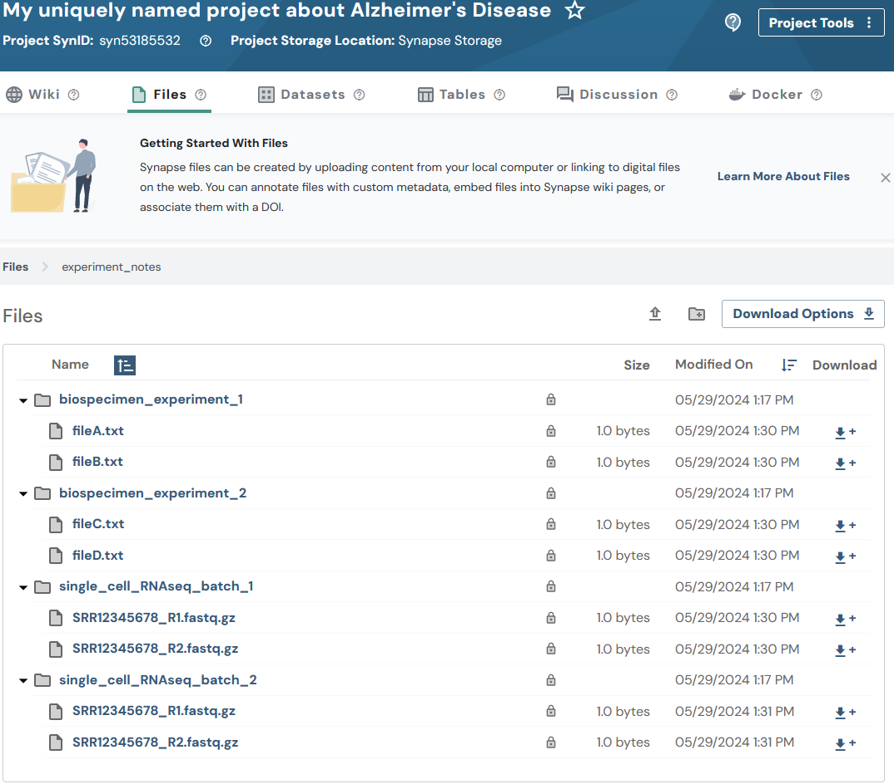

## Overview

Synapse files can be created by uploading content from your local computer
or linking to digital files on the web.

Files in Synapse always have a "parent", which could be a project or a
folder. You can organize collections of files into folders and sub-folders,
just as you would on your local computer.

See [Domain Models of Synapse](domain_models_of_synapse.html#files) for
more background on Files.

**Note:** You may optionally follow the
[Uploading data in bulk](upload_data_in_bulk.html) tutorial instead. The
bulk tutorial may fit your needs better as it limits the amount of code
that you are required to write and maintain.

This tutorial follows a
[Flattened Data Layout](https://python-docs.synapse.org/explanations/structuring_your_project/#flattened-data-layout-example).
With this example layout:

```
.
├── biospecimen_experiment_1
│   ├── fileA.txt
│   └── fileB.txt
├── biospecimen_experiment_2
│   ├── fileC.txt
│   └── fileD.txt
├── single_cell_RNAseq_batch_1
│   ├── SRR12345678_R1.fastq.gz
│   └── SRR12345678_R2.fastq.gz
└── single_cell_RNAseq_batch_2
    ├── SRR12345678_R1.fastq.gz
    └── SRR12345678_R2.fastq.gz
```

In this tutorial you will:

1. Upload several files to Synapse
2. Print stored attributes about your files
3. List all Folders and Files within your project

## Prerequisites

* Make sure that you have completed the [Folders](folder.html) vignette.
* This vignette assumes you have a number of files ready to upload. If you
  do not, create test or dummy files. You may also use
  [these dummy files used during the creation of the Python tutorials](https://github.com/Sage-Bionetworks/synapsePythonClient/tree/develop/docs/tutorials/sample_files/my_ad_project) —
  text files with example file extensions that a researcher may be using.

## 1. Upload several files to Synapse

### First, retrieve the project and folders created in the [Folders](folder.html) vignette

```{r eval=FALSE}
library(synapser)
synLogin()

my_project = Project(name = "My uniquely named project about Alzheimer's Disease") |> synGet()

# Retrieve the folders I want to upload to
batch_1_folder = Folder(parent_id = my_project$id, name = "single_cell_RNAseq_batch_1") |> synGet()
batch_2_folder = Folder(parent_id = my_project$id, name = "single_cell_RNAseq_batch_2") |> synGet()
biospecimen_experiment_1_folder = Folder(parent_id = my_project$id, name = "biospecimen_experiment_1") |> synGet()
biospecimen_experiment_2_folder = Folder(parent_id = my_project$id, name = "biospecimen_experiment_2") |> synGet()
```

### Next let's create all of the File objects to upload content

```{r eval=FALSE}
biospecimen_experiment_1_a_2022 = File(
  path = "~/my_ad_project/biospecimen_experiment_1/fileA.txt",
  parent_id = biospecimen_experiment_1_folder$id
) |> synStore()

biospecimen_experiment_1_b_2022 = File(
  path = "~/my_ad_project/biospecimen_experiment_1/fileB.txt",
  parent_id = biospecimen_experiment_1_folder$id
) |> synStore()

biospecimen_experiment_2_c_2023 = File(
  path = "~/my_ad_project/biospecimen_experiment_2/fileC.txt",
  parent_id = biospecimen_experiment_2_folder$id
) |> synStore()

biospecimen_experiment_2_d_2023 = File(
  path = "~/my_ad_project/biospecimen_experiment_2/fileD.txt",
  parent_id = biospecimen_experiment_2_folder$id
) |> synStore()

batch_1_scrnaseq_file_1 = File(
  path = "~/my_ad_project/single_cell_RNAseq_batch_1/SRR12345678_R1.fastq.gz",
  parent_id = batch_1_folder$id
) |> synStore()

batch_1_scrnaseq_file_2 = File(
  path = "~/my_ad_project/single_cell_RNAseq_batch_1/SRR12345678_R2.fastq.gz",
  parent_id = batch_1_folder$id
) |> synStore()

batch_2_scrnaseq_file_1 = File(
  path = "~/my_ad_project/single_cell_RNAseq_batch_2/SRR12345678_R1.fastq.gz",
  parent_id = batch_2_folder$id
) |> synStore()

batch_2_scrnaseq_file_2 = File(
  path = "~/my_ad_project/single_cell_RNAseq_batch_2/SRR12345678_R2.fastq.gz",
  parent_id = batch_2_folder$id
) |> synStore()
```

## 2. Print stored attributes about your files

```{r eval=FALSE}
cat("My file ID is:", batch_1_scrnaseq_file_1$id, "\n")
cat("The parent ID of my file is:", batch_1_scrnaseq_file_1$parent_id, "\n")
cat("I created my file on:", batch_1_scrnaseq_file_1$created_on, "\n")
cat("The ID of the user that created my file is:", batch_1_scrnaseq_file_1$created_by, "\n")
cat("My file was last modified on:", batch_1_scrnaseq_file_1$modified_on, "\n")
```

You'll see output like:

```
My file ID is: syn53205687
The parent ID of my file is: syn53205629
I created my file on: 2023-12-28T21:55:17.971Z
The ID of the user that created my file is: 3481671
My file was last modified on: 2023-12-28T21:55:17.971Z
```

## 3. List all Folders and Files within my project

Now that your project has a number of Folders and Files, let's explore how
we can traverse the content stored within the Project:

```{r eval=FALSE}
my_project = my_project |> synSyncFromSynapse(download_file = FALSE)
dir_mapping = my_project |> synMapDirectoryToAllContainedFiles(root_path = "./")

for (directory_name in names(dir_mapping)) {
  file_entities = dir_mapping[[directory_name]]
  cat("Directory:", directory_name, "\n")
  for (file_entity in file_entities) {
    cat("\tFile:", file_entity$name, ", ID:", file_entity$id, "\n")
  }
}
```

The result of walking your project structure should look something like:

```
Directory: ./biospecimen_experiment_1
	File: fileA.txt, ID: syn60115444
	File: fileB.txt, ID: syn60115457
Directory: ./biospecimen_experiment_2
	File: fileC.txt, ID: syn60115472
	File: fileD.txt, ID: syn60115485
Directory: ./single_cell_RNAseq_batch_1
	File: SRR12345678_R1.fastq.gz, ID: syn60115498
	File: SRR12345678_R2.fastq.gz, ID: syn60115513
Directory: ./single_cell_RNAseq_batch_2
	File: SRR12345678_R1.fastq.gz, ID: syn60115526
	File: SRR12345678_R2.fastq.gz, ID: syn60115539
```

## Results

Now that you have created your files you'll be able to inspect them on the
Files tab of your project in the Synapse web UI. It should look similar to:



## Clean Up

Delete the project and everything in it when done:

```{r eval=FALSE}
synDelete(my_project)
```

## References used in this tutorial
- [`File`](../reference/File.html)
- synLogin
- synFindEntityId
- synStore
- Folder_Walk