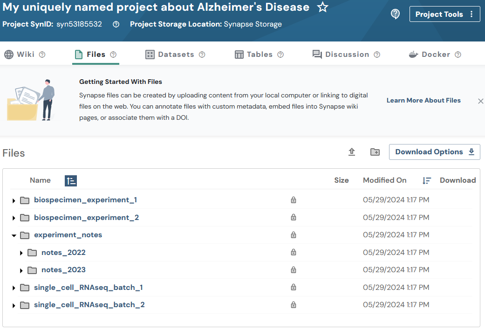

## Overview

Similar to Projects, Folders are "containers" that offer an additional w    ay
to organize your data. Instead of uploading a bunch of single files into
your project, you can create folders to separate your data in a systematic
way.

Folders in Synapse always have a "parent," which could be a project or
another folder. You can organize collections of folders and sub-folders,
just as you would on your local computer. See
[Domain Models of Synapse](domain_models_of_synapse.html#folders)
for more background on Folders.

**Note:** You may optionally follow the [Uploading data in bulk](upload_data_in_bulk.html) tutorial instead. The bulk tutorial may fit your needs better as it limits the amount of code that you are required to write and maintain.

This vignette follows a mix of
[Flattened Data Layout](https://python-docs.synapse.org/explanations/structuring_your_project/#flattened-data-layout-example)
and
[Hierarchy Data Layout](https://python-docs.synapse.org/explanations/structuring_your_project/#hierarchy-data-layout-example).
It's recommended to use one or the other, but not both — both are shown here
to demonstrate the flexibility of storing folders within folders on Synapse,
following this example layout:

```
.
├── experiment_notes
│   ├── notes_2022
│   │   ├── fileA.txt
│   │   └── fileB.txt
│   └── notes_2023
│       ├── fileC.txt
│       └── fileD.txt
├── biospecimen_experiment_1
│   ├── fileA.txt
│   └── fileB.txt
├── biospecimen_experiment_2
│   ├── fileC.txt
│   └── fileD.txt
├── single_cell_RNAseq_batch_1
│   ├── SRR12345678_R1.fastq.gz
│   └── SRR12345678_R2.fastq.gz
└── single_cell_RNAseq_batch_2
    ├── SRR12345678_R1.fastq.gz
    └── SRR12345678_R2.fastq.gz
```

In this tutorial you will:

1. Create 4 new folders
1. Print stored attributes about a folder
1. Create 2 sub-folders

## Load the package and log in
## Prerequisites
* Make sure that you have completed the [Create a Project](data_upload_download.html#create-a-project) step.

```{r eval=FALSE}
library(synapser)
synLogin()
```

Credentials are read from `~/.synapseConfig` or the `SYNAPSE_AUTH_TOKEN`
environment variable. See the
[Managing Credentials](manageSynapseCredentials.html) vignette for setup
details.

## 1. Create a new folder

Folders need a parent — here, a freshly created Project.

```{r eval=FALSE}
my_project <- Project(
  name = paste0(
    "My uniquely named project about Alzheimer's Disease ",
    paste(sample(c(letters, LETTERS, 0:9), 8, replace = TRUE), collapse = "")
  )
) |> synStore()

# Create a Folder object and store it
my_scrnaseq_batch_1_folder <- Folder(
  name = "single_cell_RNAseq_batch_1",
  parent_id = my_project$id
) |> synStore()

my_scrnaseq_batch_2_folder <- Folder(
  name = "single_cell_RNAseq_batch_2",
  parent_id = my_project$id
) |> synStore()

biospecimen_experiment_1_folder <- Folder(
  name = "biospecimen_experiment_1",
  parent_id = my_project$id
) |> synStore()

biospecimen_experiment_2_folder <- Folder(
  name = "biospecimen_experiment_2",
  parent_id = my_project$id
) |> synStore()
```

## 2. Print stored attributes about your folder

```{r eval=FALSE}
cat("My folder ID is:", my_scrnaseq_batch_1_folder$id, "\n")
cat("The parent ID of my folder is:", my_scrnaseq_batch_1_folder$parent_id, "\n")
cat("I created my folder on:", my_scrnaseq_batch_1_folder$created_on, "\n")
cat("The ID of the user that created my folder is:", my_scrnaseq_batch_1_folder$created_by, "\n")
cat("My folder was last modified on:", my_scrnaseq_batch_1_folder$modified_on, "\n")
```

You'll see output like:

```
My folder ID is: syn53205629
The parent ID of my folder is: syn53185532
I created my folder on: 2023-12-28T20:52:50.193Z
The ID of the user that created my folder is: 3481671
My folder was last modified on: 2023-12-28T20:52:50.193Z
```

## 3. Create 2 sub-folders

Folders can be nested — a folder's `parent_id` can be another folder, not
just a project:

```{r eval=FALSE}
hierarchical_root_folder <- Folder(
  name = "experiment_notes",
  parent_id = my_project$id
) |> synStore()

folder_notes_2023 <- Folder(
  name = "notes_2023",
  parent_id = hierarchical_root_folder$id
) |> synStore()

folder_notes_2022 <- Folder(
  name = "notes_2022",
  parent_id = hierarchical_root_folder$id
) |> synStore()
```

## Results

Once these folders are created you'll be able to inspect them on the Files
tab of your project in the Synapse web UI. It should look similar to:




## Clean Up

Delete the project and everything in it when done:

```{r eval=FALSE}
synDelete(my_project)
```

## References used in this tutorial
- [`Project`](../reference/Project.html)
- synLogin
- synFindEntityId
- synStore