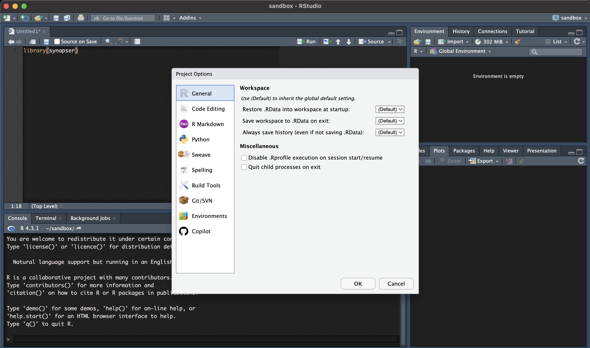
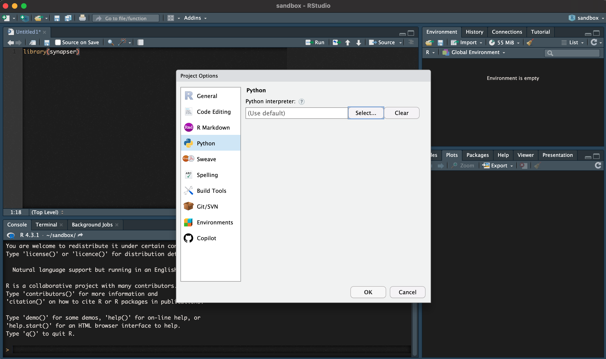
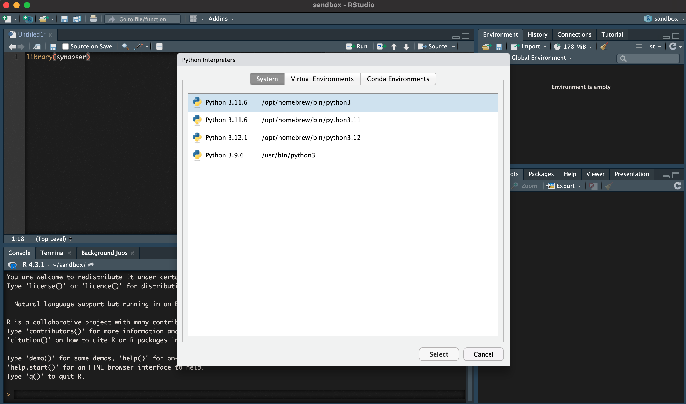
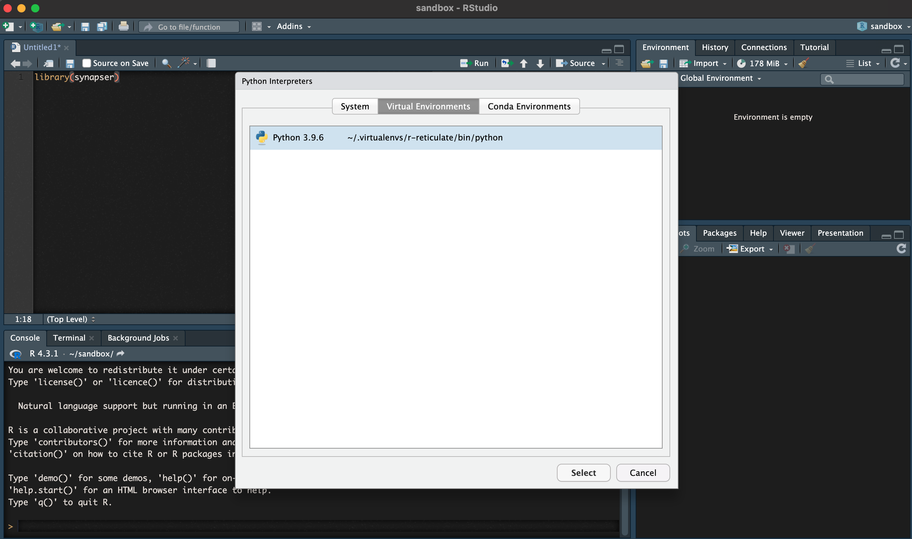
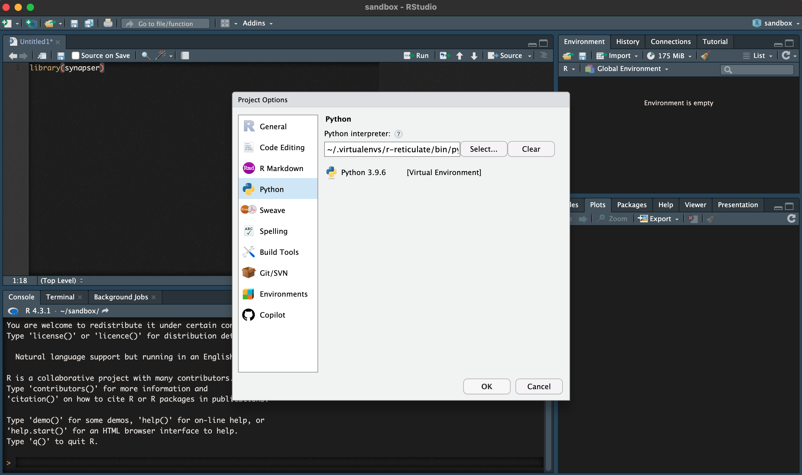

Synapser is a wrapper around the Python client.  Due to this, there are some complexities in installing the package.  Please follow this guide.

## Prerequisites

Synapser is only compatible with Python versions earlier than 3.12. Using Python 3.12 or later may result in errors. We have fully tested and recommend using Python 3.10 for optimal compatibility.

If you need to quickly switch between Python versions, we suggest using pyenv, which makes managing multiple Python versions straightforward.

# Install Python and R

## Option 1: Using pyenv (Recommended)

We strongly recommend using `pyenv` to manage Python versions, as it provides better compatibility and easier version switching. This is especially important for synapser, which requires Python 3.9-3.11 (we recommend Python 3.10).

Find more information about `pyenv` [here](https://github.com/pyenv/pyenv?tab=readme-ov-file#installation)

### Install pyenv

**For macOS:**
```bash
# Using Homebrew (recommended)
brew install pyenv

# Or using the automatic installer
curl https://pyenv.run | bash
```

**For Linux (including Ubuntu/Amazon Linux):**
```bash
# Install dependencies first
sudo apt-get update
sudo apt-get install -y make build-essential libssl-dev zlib1g-dev \
libbz2-dev libreadline-dev libsqlite3-dev wget curl llvm libncurses5-dev \
libncursesw5-dev xz-utils tk-dev libffi-dev liblzma-dev python3-openssl git

# Install pyenv
curl https://pyenv.run | bash
```

**For Amazon Linux 2/RHEL/CentOS:**
```bash
# Install dependencies first
sudo yum groupinstall -y "Development Tools"
sudo yum install -y zlib-devel bzip2-devel readline-devel sqlite-devel libffi-devel \
openssl-devel xz-devel libffi-devel

# Install pyenv
curl https://pyenv.run | bash
```

### Configure pyenv

To make pyenv available permanently, you need to add it to your shell configuration file. The temporary `export` command only works for the current session.

**Step 1: Determine your shell**
```bash
echo $SHELL
# Common outputs:
# /bin/bash  -> use ~/.bashrc or ~/.bash_profile
# /bin/zsh   -> use ~/.zshrc
```

**Step 2: Add pyenv to your shell configuration file**

**For bash users:**
```bash
# Add to ~/.bashrc (Linux) or ~/.bash_profile (macOS)
echo 'export PATH="$HOME/.pyenv/bin:$PATH"' >> ~/.bashrc
echo 'eval "$(pyenv init --path)"' >> ~/.bashrc
echo 'eval "$(pyenv init -)"' >> ~/.bashrc

# For macOS bash users, also add to ~/.bash_profile
echo 'export PATH="$HOME/.pyenv/bin:$PATH"' >> ~/.bash_profile
echo 'eval "$(pyenv init --path)"' >> ~/.bash_profile
echo 'eval "$(pyenv init -)"' >> ~/.bash_profile
```

**For zsh users:**
```bash
# Add to ~/.zshrc
echo 'export PATH="$HOME/.pyenv/bin:$PATH"' >> ~/.zshrc
echo 'eval "$(pyenv init --path)"' >> ~/.zshrc
echo 'eval "$(pyenv init -)"' >> ~/.zshrc
```

**Alternative: Manual editing**
You can also manually edit the configuration file:
```bash
# For bash
nano ~/.bashrc    # or ~/.bash_profile on macOS

# For zsh  
nano ~/.zshrc
```

Then add these lines to the file:
```bash
export PATH="$HOME/.pyenv/bin:$PATH"
eval "$(pyenv init --path)"
eval "$(pyenv init -)"
```

**Step 3: Apply the changes**
```bash
# Reload your shell configuration
source ~/.bashrc    # for bash on Linux
source ~/.bash_profile  # for bash on macOS
source ~/.zshrc     # for zsh

# OR restart your terminal
```

**Step 4: Verify pyenv is working**
```bash
pyenv --version
which pyenv  # Should show /home/username/.pyenv/bin/pyenv
```

### Install and set Python 3.10

```bash
# List available Python versions
pyenv install --list | grep " 3\.10"

# Install Python 3.10 (recommended version)
pyenv install 3.10

# Set as global default (optional)
pyenv global 3.10

# Or set as local for your project directory
cd /path/to/your/project
pyenv local 3.10

# Verify installation
python --version  # Should show Python 3.10
pyenv version
```

## Option 2: Official Python Installer (Alternative)

If you prefer not to use pyenv, you can install Python from the official installers:

1. Install Python from one of the official [Python installers](https://www.python.org/downloads/) - version 3.9 to 3.11 (we recommend Python 3.10 for optimal compatibility) and remove other versions of Python except for the one that ships with macOS located in `usr/bin/python` (note for windows: make sure to add Python to path if you're planning on running the project from outside RStudio, for example from terminal). TIP: You can verify which version you have with....

    ```
    % which -a python3
    /usr/bin/python3		# <- Default Python shipped with macOS

    % which -a python3
    /usr/local/bin/python3	# <- Official Python installer (3.11.1 for me)
    /usr/bin/python3		# <- Default Python shipped with macOS
    ```

    macOS ships with Python by default - Python 3.8 or Python 3.9.6 at the location /usr/bin/python3 - but it doesn't work well.

    Only the official installer versions work. Seriously. Please do yourself a favor and avoid having a very long, sad day because you insisted on using the version that shipped with macOS by default.
## Install R

1. Install R > v4.1.3
    a. Download links
        i. For macOS users, you can select a mirror and download R [here](https://cran.r-project.org/bin/macosx/)
        ii. For Windows and Linux users, you can select a mirror and download R [here](https://cran.r-project.org/mirrors.html)
    NOTE: There might be an issue installing v4.0.0; please use v4.1.3+ for the best experience
1. Install [RStudio Desktop](https://posit.co/download/rstudio-desktop/)
1. For Windows users, if you intend to run the project from outside [RStudio Desktop](https://posit.co/download/rstudio-desktop/)
(for example: VS Code or Terminal) the only additional step is to add R to system path: `C:\Program Files\R\R-4.1.3\bin\R.exe`


## Troubleshooting

- If you get an error while building the project that it cannot find synapseclient module.
This is because RStudio is using the wrong python version. To get [RStudio Desktop](https://posit.co/download/rstudio-desktop/) to build the package correctly, navigate to Tools > Project Options > Python > Virtual Envs and select the first entry `~/.virtualenvs/r-reticulate` (or Conda if that's your preferred Python virtual env) and perform the below step. R-Studio will re-create a virtual environment at that path using the correct Python version. Manually specifying python at the official installation path doesn't always fix it.
- If you have already tried building the project with an older version of Python, make sure to remove `~/.virtualenvs/r-reticulate` before re-building (it will be re-created).
- If you halt the build process, a lock file might be left behind, which will need to be manually deleted (`$HOME\AppData\Local\R\win-library\4.2\00LOCK-synapser`)
- macOS ships with Python by default - Python 3.8 or Python 3.9.6 at the location `/usr/bin/python`3 - but it doesn't work well.
- If you're intending to run the project from terminal or VSCode on Windows and forgot to add python to path, it can be added manually using system environment variables: `C:\Users\USER\AppData\Local\Programs\Python\Python310\`


# Synapse Installation

## Install from RStudio

- This guide assumes you have Python, R, and RStudio Desktop installed as described above.
- This guide will presume most users want to install and work with Synapse from RStudio Desktop.

Once that's complete, we are ready to move on to selecting our desired Python interpreter. If the above fails, follow
the steps below, then run the installation.

1. Select your project's desired Python interpreter
    
  To select our desired Python interpreter, let's navigate to Tools > Project Options (or Global Options)

  {#id .class width=600 height=400px}

2. Let's select Python from the list of options on the left hand side:

  {#id .class width=600 height=400px}

3. Click Select

  {#id .class width=600 height=400px}

4. Select the Virtual Environments tab:

  {#id .class width=600 height=400px}

5. Click on Select to choose our desired Reticulate virtual environment:

  {#id .class width=600 height=400px}

  In the example above, we can see that my desired Python 3.9.6 environment (your python version may be different, and that's ok)
installed from the official Python installer and NOT the Python version that shipped on macOS - is selected.


## Install from R


### Step-by-Step Installation with Dependency Management

Below are step-by-step instructions for installing synapser using Python 3.10. If you followed the pyenv installation above, these steps will use your pyenv-managed Python. If you're using a system Python installation, ensure it's Python 3.10.

#### Prerequisites: Verify Python Installation

**If using pyenv (recommended):**
```bash
# This is a bash session - Not R code
# Verify pyenv is working and Python 3.10 is installed
pyenv versions
python --version  # Should show Python 3.10
pyenv version
```

**If using system Python:**
```bash
# This is a bash session - Not R code
# Verify you have Python 3.10
python3 --version  # Should show Python 3.10.x
which python3
```

#### R Installation Steps

1. **Remove existing reticulate virtual environment** (provides a clean environment for installation):
   ```r
   # Remove any existing virtual environment
   reticulate::virtualenv_remove(envname='r-reticulate')
   ```

2. **Create a virtual environment using your Python 3.10 installation:**
   
   **If using pyenv (recommended):**
   ```r
   # This will use the pyenv-managed Python 3.10
   # You must replace '3.10.x' with the specific version you installed, e.g., '3.10.18'
   reticulate::virtualenv_create(envname='r-reticulate', version = '3.10.x')
   ```
   
   **If using system Python 3.10:**
   ```r
   # Specify the system Python path explicitly
   python_path <- Sys.which("python3")

   reticulate::virtualenv_create(envname='r-reticulate', python = python_path)
   ```

3. **Install synapser using remotes (this will automatically handle dependency versions):**
   
   **For the latest version:**
   ```r
   # Install remotes if not already installed
   if (!require("remotes", quietly = TRUE)) {
     install.packages("remotes")
   }

   reticulate::use_virtualenv("r-reticulate", required = TRUE)
   
   # Install the latest version of synapser (handles compatible dependency versions automatically)
   remotes::install_cran("synapser", repos = c("http://ran.synapse.org", "https://cloud.r-project.org"))
   ```
   
   **For a specific version:**
   ```r
   # Install remotes if not already installed
   if (!require("remotes", quietly = TRUE)) {
     install.packages("remotes")
   }

   reticulate::use_virtualenv("r-reticulate", required = TRUE)
   
   # Install a specific version of synapser (e.g., version 2.1.1.259 - major.minor.patch.build)
   remotes::install_version("synapser", version = "X.Y.Z.AAA", repos = c("http://ran.synapse.org", "https://cloud.r-project.org"))
   ```

   **Installing from source:**
   ```r
   reticulate::use_virtualenv("r-reticulate", required = TRUE)

   remotes::install_local(path=".", upgrade = "never")
   ```

4. **If you encounter issues with the rjson package compatibility** (typically occurs if you have previously installed a newer version of rjson or are using a newer version of Python), you can manually install compatible versions:
   ```r
   remove.packages("rjson")

   remotes::install_version("rjson", "0.2.21")
   remotes::install_version("reticulate", "1.28")
   ```
   Then try step 3 again.

### Alternative Simple Installation

If you don't have dependency conflicts, you can try the simple installation:
```r
install.packages("synapser", repos = c("http://ran.synapse.org", "https://cloud.r-project.org"))
```
