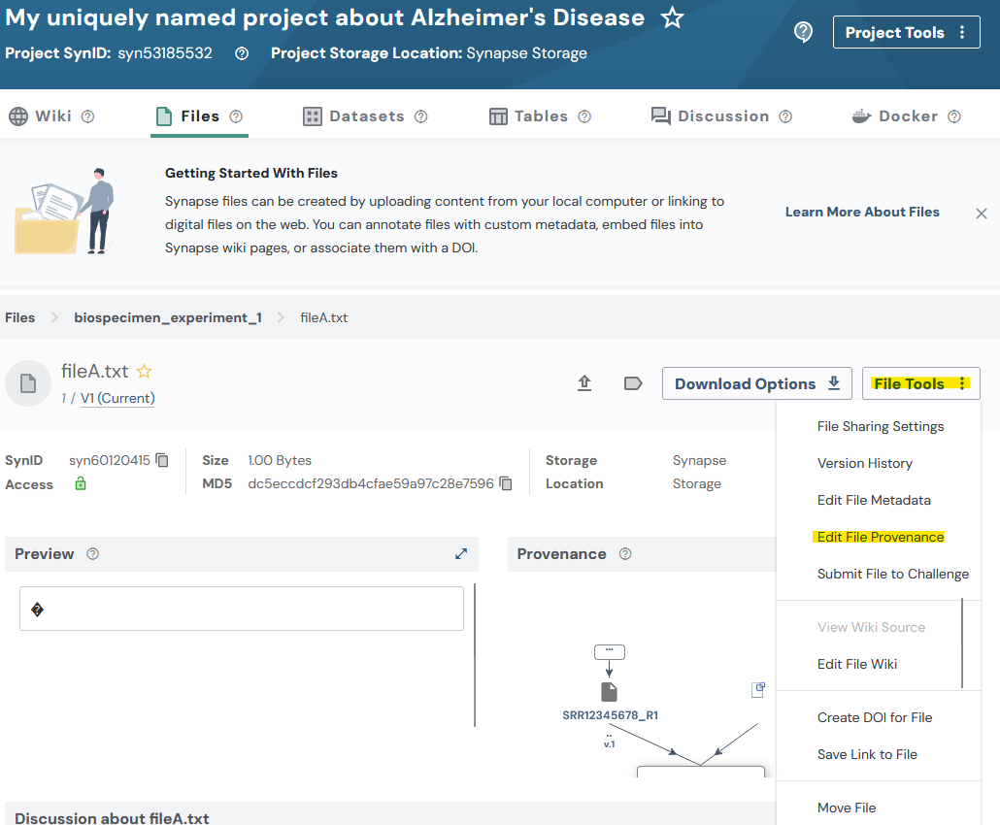
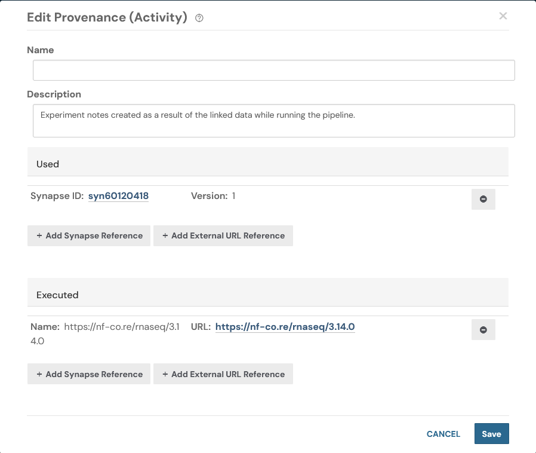

## Uploading data in bulk

This tutorial will follow a
[Flattened Data Layout](structuring_your_project.html#flattened-data-layout-example).
With a project that has this example layout:
```
.
├── biospecimen_experiment_1
│   ├── fileA.txt
│   └── fileB.txt
├── biospecimen_experiment_2
│   ├── fileC.txt
│   └── fileD.txt
├── single_cell_RNAseq_batch_1
│   ├── SRR12345678_R1.fastq.gz
│   └── SRR12345678_R2.fastq.gz
└── single_cell_RNAseq_batch_2
    ├── SRR12345678_R1.fastq.gz
    └── SRR12345678_R2.fastq.gz
```

## Tutorial Purpose

In this tutorial you will:

1. Set up constants for your project
1. Create a manifest CSV file to upload data in bulk
1. Upload all of the files for our project
1. Add an annotation to all of our files
1. Add a provenance/activity record to one of our files

> **Preferred API:** The recommended way to upload files in bulk is
> `synSyncToSynapse()` on a `Project` (or a `Folder`).
> The legacy `syncToSynapse` utility function is deprecated.


## Prerequisites

* Make sure that you have completed the following tutorials:
    * [Project](data_upload_download.html#create-a-project)
* This tutorial is setup to upload the data from `~/my_ad_project`, make sure that this or
another desired directory exists.
* This tutorial uses base R's `read.csv()` and `write.csv()` to edit the manifest. You may
also use external tools to open and manipulate CSV files.


## 1. Set up constants

First let's set up some constants we'll use in this script
```{r eval=FALSE}
library(synapser)
synLogin()

# Step 1: Create some constants to store the paths to the data
DIRECTORY_FOR_MY_PROJECT = "test_folder"  # This should exist with your files in it
PATH_TO_MANIFEST_FILE = "test_manifest.csv"  # This doesn't need to exist yet
SYNAPSE_PROJECT_ID = ""  # Put your Synapse project ID here. This is the project where you want to upload your data.
project = Project(id = SYNAPSE_PROJECT_ID)
```

## 2. Create a manifest CSV file to upload data in bulk

We call `synGenerateSyncManifest()` on the project we want to mirror into.
It walks our local directory and produces a CSV manifest that maps each file to
the correct parent folder in Synapse (creating folders as needed). The output
is ready to hand directly to `synSyncToSynapse()`.

```{r eval=FALSE}
# Step 2: Create a manifest CSV file with the paths to the files and their parent folders
# Note: When this command is run it will re-create your directory structure within
# Synapse. Be aware of this before running this command.
# If folders with the exact names already exists in Synapse, those folders will be used.
project |> synGenerateSyncManifest(
  directory_path = DIRECTORY_FOR_MY_PROJECT,
  manifest_path = PATH_TO_MANIFEST_FILE
)
```

After this has been run if you inspect the CSV file created you'll see it will look
similar to this:
```
path,parentId
/home/user_name/my_ad_project/single_cell_RNAseq_batch_2/SRR12345678_R2.fastq.gz,syn60109537
/home/user_name/my_ad_project/single_cell_RNAseq_batch_2/SRR12345678_R1.fastq.gz,syn60109537
/home/user_name/my_ad_project/biospecimen_experiment_2/fileD.txt,syn60109543
/home/user_name/my_ad_project/biospecimen_experiment_2/fileC.txt,syn60109543
/home/user_name/my_ad_project/single_cell_RNAseq_batch_1/SRR12345678_R2.fastq.gz,syn60109534
/home/user_name/my_ad_project/single_cell_RNAseq_batch_1/SRR12345678_R1.fastq.gz,syn60109534
/home/user_name/my_ad_project/biospecimen_experiment_1/fileA.txt,syn60109540
/home/user_name/my_ad_project/biospecimen_experiment_1/fileB.txt,syn60109540
```

## 3. Upload the data in bulk
```{r eval=FALSE}
# Step 3: After generating the manifest file, we can upload the data in bulk
project |> synSyncToSynapse(manifest_path = PATH_TO_MANIFEST_FILE, send_messages = FALSE)
```


While this is running you'll see output in your console similar to:
```
Validating manifest: /home/user_name/manifest-for-upload.csv
Validating that all paths exist...
Validating that all files are unique...
Validating that all the files are not empty...
Validating file names...
Validating provenance and parent containers...
About to upload 8 files with a total size of 8 bytes.
Uploading 8 files: 100%|███████████████████| 8.00/8.00 [00:01<00:00, 6.09B/s]
```


## 4. Add an annotation to our manifest file
At this point in the tutorial we will use base R to manipulate the CSV manifest. You may
also use any tool that can open and manipulate CSV files such as Excel or Google Sheets.

```{r eval=FALSE}
# Step 4: Let's add an annotation to our manifest file

# Read the CSV file into a data frame
df = read.csv(PATH_TO_MANIFEST_FILE)

# Add a new column to the data frame
df$species = "Homo sapiens"

# Write the data frame back to the manifest file. `na = ""` writes missing values
# as empty cells rather than the string "NA", which would otherwise be uploaded.
write.csv(df, PATH_TO_MANIFEST_FILE, row.names = FALSE, na = "")

project |> synSyncToSynapse(manifest_path = PATH_TO_MANIFEST_FILE, send_messages = FALSE)
```

Now that you have uploaded and annotated your files you'll be able to inspect your data
on the Files tab of your project in the synapse web UI. Each file will have a single
annotation that you added in the previous step. In more advanced workflows you'll likely
need to build a more complex manifest file, but this should give you a good starting
point.


## 5. Create an Activity/Provenance
Let's create an [Activity/Provenance](domain_models_of_synapse.html#activityprovenance)
record for one of our files. In other words, we will record the steps taken to generate
the file.

In this code we are finding a row in our CSV file and pointing to the file path of
another file within our manifest. By doing this we are creating a relationship between
the two files. This is a simple example of how you can create a provenance record in
Synapse. Additionally we'll link off to a sample URL that describes a process that we
may have executed to generate the file.

```{r eval=FALSE}
# Step 5: Let's create an Activity/Provenance
# First let's find the row in the CSV we want to update. This code finds the row number
# that we would like to update.
row_index = which(
  df$path == file.path(DIRECTORY_FOR_MY_PROJECT, "biospecimen_experiment_1", "fileA.txt")
)

# After finding the row we want to update let's go ahead and add a relationship to
# another file in our manifest. This allows us to say "We used 'this' file in some way".
df[row_index, "used"] = file.path(
  DIRECTORY_FOR_MY_PROJECT, "single_cell_RNAseq_batch_1", "SRR12345678_R1.fastq.gz"
)

# Let's also link to the pipeline that we ran in order to produce these results. In a
# real scenario you may want to link to a specific run of the tool where the results
# were produced.
df[row_index, "executed"] = "https://nf-co.re/rnaseq/3.14.0"

# Let's also add a description for this Activity/Provenance
df[row_index, "activityDescription"] =
  "Experiment results created as a result of the linked data while running the pipeline."

# Write the data frame back to the manifest file
write.csv(df, PATH_TO_MANIFEST_FILE, row.names = FALSE, na = "")

project |> synSyncToSynapse(manifest_path = PATH_TO_MANIFEST_FILE, send_messages = FALSE)
```

After running this code we may again inspect the synapse web UI. In this screenshot I've
navigated to the Files tab and selected the file that we added a Provenance record to.








## References used in this tutorial

- [`synLogin`](../reference/synLogin.html)
- [`synGenerateSyncManifest`](../reference/Project_GenerateSyncManifest.html)
- [`synSyncToSynapse`](../reference/Project_SyncToSynapse.html)
- [Manifest CSV format](manifest_csv.html)
- [Activity/Provenance](domain_models_of_synapse.html#activityprovenance)
